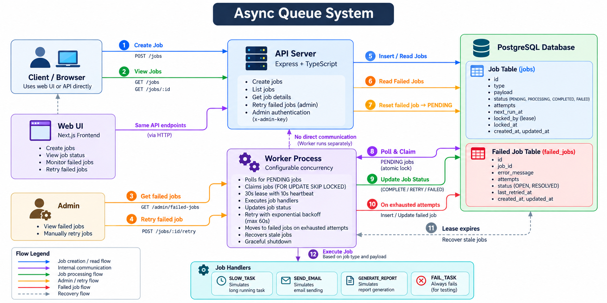
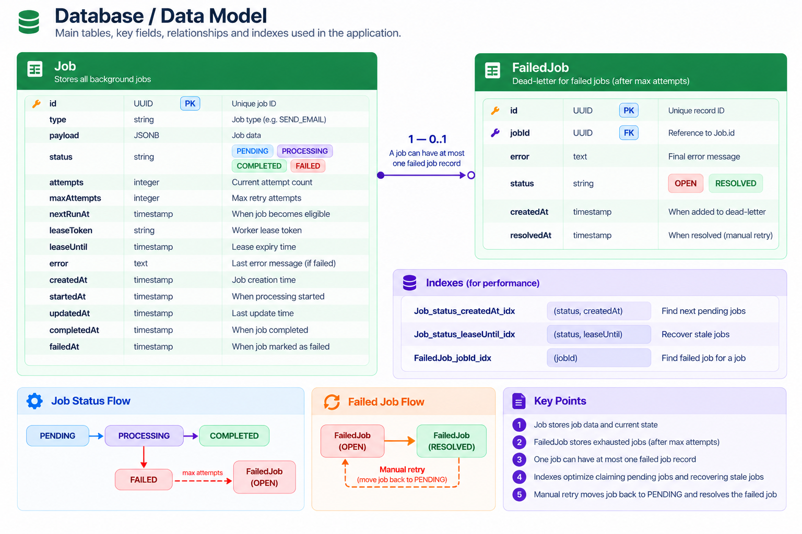

# Async Queue

A persistent background job processing system built with **TypeScript, Node.js, Express, PostgreSQL, and raw SQL**.

Async Queue separates **job submission** from **job execution** and provides reliable background processing with concurrency control, leases, heartbeats, retries, failure recovery, and manual dead-letter handling.

The project focuses on making the core mechanics of a production-style background job system understandable without introducing unnecessary infrastructure.

## Key Features

* Persistent job storage with PostgreSQL
* Atomic job claiming with `FOR UPDATE SKIP LOCKED`
* Configurable worker concurrency
* Lease-based job ownership
* Heartbeats for long-running jobs
* Automatic stale-job recovery
* Exponential retry backoff
* Failed-job / dead-letter storage
* Manual retry for failed jobs
* Graceful worker shutdown
* At-least-once execution semantics
* Separate API and worker processes
* Raw SQL for database operations

---

## Architecture

The API and worker run as separate processes, while PostgreSQL acts as the **single source of truth** for job state.



The system consists of three primary components:

* **API** — accepts jobs and exposes job-management endpoints
* **Worker** — claims, executes, retries, and recovers jobs
* **PostgreSQL** — persists jobs, leases, attempts, and failed-job records

---

## Job Lifecycle

```text
                    ┌───────────────┐
                    │    PENDING    │
                    └───────┬───────┘
                            │
                            ▼
                    ┌───────────────┐
                    │  PROCESSING   │
                    └───────┬───────┘
                            │
                 ┌──────────┴──────────┐
                 │                     │
                 ▼                     ▼
          ┌─────────────┐      ┌─────────────┐
          │  COMPLETED  │      │   FAILURE   │
          └─────────────┘      └──────┬──────┘
                                      │
                           ┌──────────┴──────────┐
                           │                     │
                           ▼                     ▼
                     Retry available       Attempts exhausted
                           │                     │
                           ▼                     ▼
                      PENDING                 FAILED
                                                 │
                                                 ▼
                                           FailedJob
```

If a worker crashes while processing a job, its lease eventually expires. The job can then be recovered and processed again.

---

## Database Design

PostgreSQL stores both the current state of each job and its execution history required for recovery and operational handling.



---

## Reliability

### Atomic Job Claiming

Multiple workers can safely compete for pending jobs using PostgreSQL row-level locking:

```sql
FOR UPDATE SKIP LOCKED
```

A worker locks an eligible job while claiming it. Other workers skip already-locked rows instead of waiting for them.

This allows multiple workers to process jobs concurrently without claiming the same job at the same time.

### Leases

When a worker claims a job, it receives:

* a lease token
* a lease expiration time

Operations that complete or fail a job must match the worker's lease token.

If the worker disappears, the lease eventually expires and the job becomes eligible for recovery.

### Heartbeats

Long-running jobs may outlive their initial lease.

Workers periodically renew the lease while the job is still executing. This prevents legitimate long-running work from being incorrectly recovered by another worker.

### Stale Job Recovery

If a worker crashes or stops renewing a lease, the job can be detected as stale and returned to the normal processing flow.

This allows abandoned jobs to recover without requiring manual database intervention.

### Retries

Retryable failures return the job to `PENDING` while attempts remain.

Retry delays use exponential backoff with an upper bound to avoid repeatedly retrying failing work too aggressively.

### Failed Jobs

When a job exhausts its configured attempts:

1. The job becomes `FAILED`.
2. A `FailedJob` record is created.
3. The job becomes visible through the admin failed-job endpoint.
4. An administrator can manually retry it.

Manual retry returns the job to the normal `PENDING` execution flow.

A successful retry resolves the corresponding failed-job record.

---

## Execution Semantics

Async Queue provides **at-least-once execution**.

It does **not** guarantee exactly-once execution.

For example, a worker could:

1. Execute an external side effect.
2. Crash before recording the job as completed.
3. Lose its lease.
4. Have another worker execute the job again.

As a result, external side effects should be **idempotent where possible**.

This is an intentional design decision and an important property of the system.

---

## Supported Job Types

| Type              | Purpose                                  |
| ----------------- | ---------------------------------------- |
| `SLOW_TASK`       | Simulates a long-running job             |
| `SEND_EMAIL`      | Simulates email processing               |
| `GENERATE_REPORT` | Simulates report generation              |
| `FAIL_TASK`       | Demonstrates failures and retry behavior |

The queue mechanism is independent of individual handlers. New job types can be added by implementing additional handlers without changing the core queue processing logic.

---

## API

| Method | Endpoint             | Description                 |
| ------ | -------------------- | --------------------------- |
| `POST` | `/jobs`              | Create a job                |
| `GET`  | `/jobs`              | List jobs                   |
| `GET`  | `/jobs/:id`          | Get a specific job          |
| `POST` | `/jobs/:id/retry`    | Manually retry a failed job |
| `GET`  | `/admin/failed-jobs` | List failed jobs            |
| `GET`  | `/health`            | Check API health            |

Admin endpoints require the `x-admin-key` header.

The key is configured through `ADMIN_API_KEY`.

### Create a Job

```bash
curl -X POST http://localhost:4000/jobs \
  -H "Content-Type: application/json" \
  -d '{"type":"SLOW_TASK","payload":{"durationMs":5000}}'
```

---

## Getting Started

### Requirements

* Node.js
* PostgreSQL
* Docker *(optional)*

### Installation

Clone the repository and install dependencies:

```bash
npm install
```

Create your environment file:

```bash
cp .env.example .env
```

Start PostgreSQL:

```bash
docker compose up -d
```

Initialize the database:

```bash
npm run db:init
```

### Start the Application

Run the API and worker separately:

```bash
npm run dev:api
```

```bash
npm run dev:worker
```

Or run both together:

```bash
npm run dev
```

---

## Configuration

The application can be configured through environment variables:

```env
DATABASE_URL=
PORT=

WORKER_POLL_MS=
WORKER_CONCURRENCY=

MAX_ATTEMPTS=

LOG_LEVEL=info

ADMIN_API_KEY=
```

| Variable             | Description                        |
| -------------------- | ---------------------------------- |
| `DATABASE_URL`       | PostgreSQL connection string       |
| `PORT`               | API server port                    |
| `WORKER_POLL_MS`     | Worker polling interval            |
| `WORKER_CONCURRENCY` | Maximum concurrent jobs per worker |
| `MAX_ATTEMPTS`       | Default maximum retry attempts     |
| `LOG_LEVEL`          | Application log level              |
| `ADMIN_API_KEY`      | Key required for admin operations  |

---

## Design Decisions

### PostgreSQL as the Queue Store

PostgreSQL provides the persistence, transactions, and row-level locking required by the queue without introducing another infrastructure dependency.

It also keeps job state and recovery logic visible and understandable.

### `FOR UPDATE SKIP LOCKED`

`SKIP LOCKED` allows multiple workers to compete for work without waiting on rows another worker is currently claiming.

This provides a simple foundation for concurrent job processing.

### Lease-Based Ownership

A worker can crash after claiming a job.

Without a lease, that job could remain stuck in `PROCESSING` indefinitely.

Leases provide a mechanism for detecting abandoned work and recovering it.

### Heartbeats

A fixed lease duration is not sufficient for jobs whose execution time can vary.

Heartbeats allow active workers to extend their ownership while processing continues.

### Failed-Job Store

Jobs that permanently fail need a separate operational path.

The failed-job store allows administrators to inspect failures and retry them manually without complicating the normal processing path.

---

## Project Structure

```text
src/
├── api/                    # HTTP routes, controllers, validation
├── application/            # Application-level job operations
├── domain/                 # Domain models and types
├── infrastructure/
│   └── database/           # PostgreSQL client, schema, repositories
├── handlers/               # Job-specific handlers
└── worker/                 # Polling, execution, recovery, shutdown

docs/
├── architecture.png
└── db_design.png
```

---

## Development

Build the project:

```bash
npm run build
```

---

## Scope

Async Queue is intentionally a focused **V1 implementation** for understanding persistent background processing, concurrency, retries, and failure recovery.

It does not attempt to solve every problem associated with distributed job infrastructure.

The project intentionally does not introduce:

* Redis
* Kafka
* External message brokers
* Distributed scheduling
* Multi-region processing
* Advanced observability infrastructure
* Exactly-once execution guarantees

The goal is to keep the core queue mechanics **small, understandable, and explicit**, while still addressing the important failure modes of background job processing.

---

## Core Guarantees

| Capability                        | Supported |
| --------------------------------- | --------- |
| Persistent jobs                   | Yes       |
| Concurrent workers                | Yes       |
| Atomic job claiming               | Yes       |
| Lease-based ownership             | Yes       |
| Heartbeats                        | Yes       |
| Crash recovery                    | Yes       |
| Automatic retries                 | Yes       |
| Exponential backoff               | Yes       |
| Dead-letter / failed-job handling | Yes       |
| Manual retry                      | Yes       |
| Graceful shutdown                 | Yes       |
| At-least-once execution           | Yes       |
| Exactly-once execution            | No        |

---

## License

This project is intended as a focused engineering project for exploring the design and implementation of persistent background job processing systems.
